# 03 WBS 任务分解全景图（大任务与小任务结构树）

> [!NOTE]
> **WBS（Work Breakdown Structure · 工作分解结构）** 是工程项目管理的国际黄金标准。
> 本图将 ListenLoop 的远期大目标逐层拆解为**可交付、可度量、可验收的最小工程任务**。

---

## 1. WBS 任务分解全景架构树

```mermaid
graph TD
    classDef epic fill:#1e293b,stroke:#475569,stroke-width:2px,color:#fff;
    classDef done fill:#059669,stroke:#047857,stroke-width:2px,color:#fff;
    classDef doing fill:#d97706,stroke:#b45309,stroke-width:2px,color:#fff;
    classDef todo fill:#475569,stroke:#334155,stroke-width:1px,color:#94a3b8;

    ROOT["🚀 ListenLoop 商业工程体系"]:::epic

    %% 大任务 Epic
    EPIC_CORE["📦 EPIC-01: 核心播放与分句引擎"]:::epic
    EPIC_MEDIA["🎬 EPIC-02: 多语言影视制课管线"]:::epic
    EPIC_AI["🤖 EPIC-03: AI 智能管家与特训法"]:::epic
    EPIC_ANKI["🃏 EPIC-04: 纯英文 Anki 记忆体系"]:::epic
    EPIC_AUTO["🧠 EPIC-05: 全自主学习运行时"]:::epic

    ROOT --> EPIC_CORE
    ROOT --> EPIC_MEDIA
    ROOT --> EPIC_AI
    ROOT --> EPIC_ANKI
    ROOT --> EPIC_AUTO

    %% EPIC-01 子任务
    EPIC_CORE --> T_AUDIO_P95["Task 1.1: 句级播放引擎误差<20ms"]:::done
    EPIC_CORE --> T_RACE_GUARD["Task 1.2: 切句竞态与重读防护"]:::done
    EPIC_CORE --> T_TYPO_SCALE["Task 1.3: S/M/L/XL字号防过小"]:::done

    %% EPIC-02 子任务
    EPIC_MEDIA --> T_CJK_SEG["Task 2.1: CJK中日韩智能断句"]:::done
    EPIC_MEDIA --> T_ASR_CLEAN["Task 2.2: Whisper幻觉循环清洗"]:::done
    EPIC_MEDIA --> T_YOUR_NAME["Task 2.3: 你的名字1589句直装入库"]:::done
    EPIC_MEDIA --> T_FAST_IMPORT["Task 2.4: Download免选一键导入"]:::doing

    %% EPIC-03 子任务
    EPIC_AI --> T_3MIN_QUIZ["Task 3.1: 尚雯婕3分钟限时快测"]:::done
    EPIC_AI --> T_SEEK_BACK["Task 3.2: 错题一键定位原声毫秒"]:::done
    EPIC_AI --> T_HOME_SLOT["Task 3.3: 首页动态弱点插槽"]:::done
    EPIC_AI --> T_TUTOR_CHAT["Task 3.4: AI伴学抽屉即时探讨"]:::done
    EPIC_AI --> T_WEAK_LIST["Task 3.5: 错题聚合重听清单"]:::doing

    %% EPIC-04 子任务
    EPIC_ANKI --> T_WEAK_DB["Task 4.1: SQLite弱点数据表落地"]:::done
    EPIC_ANKI --> T_EN_STAR["Task 4.2: 纯英文生词打星收藏"]:::doing
    EPIC_ANKI --> T_EN_LINKING["Task 4.3: 连读弱读规则自动标注"]:::doing
    EPIC_ANKI --> T_APKG_EXPORT["Task 4.4: 导出标准.apkg卡包"]:::todo

    %% EPIC-05 子任务
    EPIC_AUTO --> T_RADAR["Task 5.1: 个人听力能力画像雷达"]:::todo
    EPIC_AUTO --> T_SRS_SCHEDULE["Task 5.2: 艾宾浩斯抗遗忘智能排程"]:::todo
    EPIC_AUTO --> T_SHADOW_EVAL["Task 5.3: 影子跟读语音打分纠错"]:::todo
```

---

## 2. 大任务与小任务状态清单 (WBS Matrix)

### EPIC-01：核心播放与分句引擎（完成度：100% 🟢）
- [x] **Task 1.1**：基于 `just_audio` 的高精度句级播放器，真机停止误差 P95 < 18ms。
- [x] **Task 1.2**：实现 `setClip` 与 `completionStream` 竞态防护，消除自动续句首词重读问题。
- [x] **Task 1.3**：字号动态缩放（S:0.50x, M:0.75x, L:1.00x, XL:1.30x），实现中文防过小保护。

### EPIC-02：多语言影视级全流程制课管线（完成度：85% 🟢）
- [x] **Task 2.1**：研发 CJK（中日韩无空格语言）切词与黄金精听（2~8s）分句算法。
- [x] **Task 2.2**：实现正则循环捕获器，彻底清洗 Whisper 在 BGM 处的自回归假名幻觉。
- [x] **Task 2.3**：全流程交付《你的名字》电影全片（1589 句中日双语文学精修台词 + 4K 超清封面 + 82MB 无损原声）。
- [ ] **Task 2.4**：优化 HyperOS 导入体验，支持自动扫描 Download 目录直接入库（进行中 🟡）。

### EPIC-03：AI 智能管家与特训法（完成度：80% 🟢）
- [x] **Task 3.1**：研发【尚雯婕 3 分钟限时快测】，180 秒倒计时高压作答。
- [x] **Task 3.2**：实现错题一键「🎧 重新听这句」，秒级 seek 回原声对白。
- [x] **Task 3.3**：书架页顶部落地【动态弱点插槽】，根据错题动态提示复习。
- [x] **Task 3.4**：实现 AI 伴学底板抽屉，以当前句为上下文展开多轮探讨。
- [ ] **Task 3.5**：聚合所有错题，生成【弱点攻坚循环连播模式】（进行中 🟡）。

### EPIC-04：纯英文 Anki 记忆卡体系（完成度：40% 🟡 当前重点）
- [x] **Task 4.1**：底层完成 `weakness_records` 弱点数据表构建。
- [ ] **Task 4.2**：实现播放页纯英文原声对白打星与生词本沉淀（进行中 🟡）。
- [ ] **Task 4.3**：接入 AI 自动分析该句连读（Linking）、弱读（Reduction）与失爆规律（进行中 🟡）。
- [ ] **Task 4.4**：实现一键导出包含原声切片与双语对白的标准 `.apkg` 记忆卡包（待启动 ⚪）。

### EPIC-05：全自主学习运行时（远期规划 ⚪）
- [ ] **Task 5.1**：基于错题历史绘制听力能力雷达图（连读盲区、词汇盲区、语速盲区）。
- [ ] **Task 5.2**：结合艾宾浩斯遗忘曲线实现每日个性化复习推送。
- [ ] **Task 5.3**：集成移动端语音测评，实现影子跟读智能打分与纠错。
