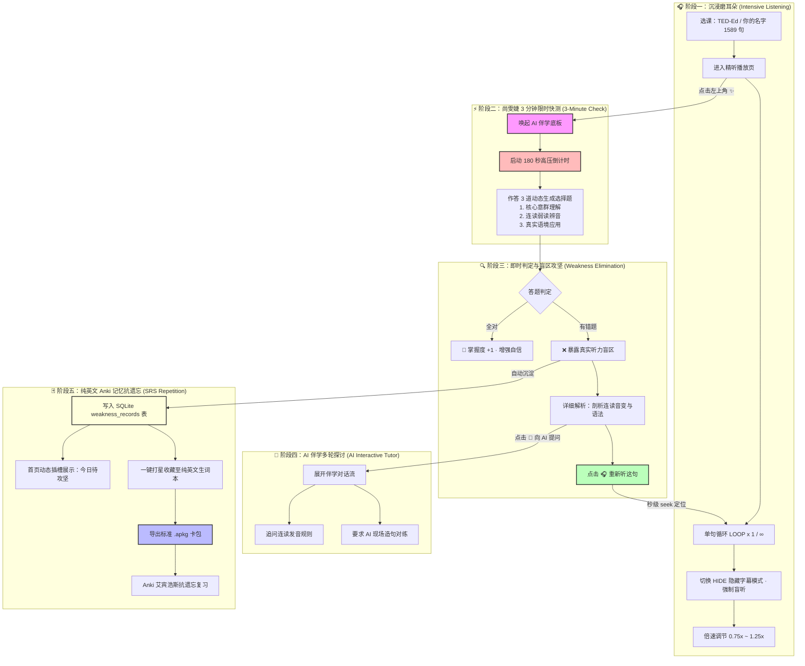

# 01 学习闭环与特训流程图 (Learning & Training Flow)

> [!NOTE]
> 本图展示用户从**“选课 ➔ 沉浸磨耳 ➔ 3分钟限时快测 ➔ 错题解析 ➔ AI 伴学 ➔ 弱点沉淀 ➔ Anki 复习”**的完整交互流。

---

```mermaid
flowchart TD
    subgraph S1["🎧 阶段一：沉浸磨耳朵 (Intensive Listening)"]
        A[选课：TED-Ed / 你的名字 1589 句] --> B[进入精听播放页]
        B --> C[单句循环 LOOP x 1 / ∞]
        C --> D[切换 HIDE 隐藏字幕模式 · 强制盲听]
        D --> E[倍速调节 0.75x ~ 1.25x]
    end

    subgraph S2["⚡ 阶段二：尚雯婕 3 分钟限时快测 (3-Minute Check)"]
        B -->|点击左上角 ✨| F[唤起 AI 伴学底板]
        F --> G[启动 180 秒高压倒计时]
        G --> H[作答 3 道动态生成选择题<br>1. 核心意群理解<br>2. 连读弱读辨音<br>3. 真实语境应用]
    end

    subgraph S3["🔍 阶段三：即时判定与盲区攻坚 (Weakness Elimination)"]
        H --> I{答题判定}
        I -->|全对| J[🎉 掌握度 +1 · 增强自信]
        I -->|有错题| K[❌ 暴露真实听力盲区]
        K --> L[详细解析：剖析连读音变与语法]
        L --> M[点击 🎧 重新听这句]
        M -->|秒级 seek 定位| C
    end

    subgraph S4["🤖 阶段四：AI 伴学多轮探讨 (AI Interactive Tutor)"]
        L -->|点击 💬 向 AI 提问| N[展开伴学对话流]
        N --> O[追问连读发音规则]
        N --> P[要求 AI 现场造句对练]
    end

    subgraph S5["🃏 阶段五：纯英文 Anki 记忆抗遗忘 (SRS Repetition)"]
        K -->|自动沉淀| Q[写入 SQLite weakness_records 表]
        Q --> R[首页动态插槽展示：今日待攻坚]
        Q --> S[一键打星收藏至纯英文生词本]
        S --> T[导出标准 .apkg 卡包]
        T --> U[Anki 艾宾浩斯抗遗忘复习]
    end

    style F fill:#f9f,stroke:#333,stroke-width:2px
    style G fill:#fbb,stroke:#333,stroke-width:2px
    style M fill:#bfb,stroke:#333,stroke-width:2px
    style Q fill:#ffd,stroke:#333,stroke-width:2px
    style T fill:#bbf,stroke:#333,stroke-width:2px
```
