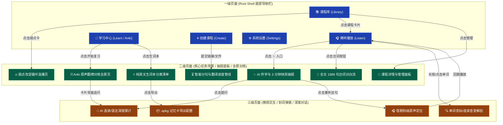

# 02 三级页面导航拓扑图 (Page Navigation Topology)

> [!NOTE]
> 本图展示移动端 App 的三级路由跳转拓扑（Level 1 根底栏 ➔ Level 2 场景页面/抽屉 ➔ Level 3 弹窗交互）。

---

```mermaid
graph TD
    classDef l1 fill:#1e40af,stroke:#1d4ed8,stroke-width:2px,color:#fff;
    classDef l2 fill:#065f46,stroke:#047857,stroke-width:2px,color:#fff;
    classDef l3 fill:#92400e,stroke:#b45309,stroke-width:2px,color:#fff;

    subgraph L1["一级页面 (Root Shell 底部导航栏)"]
        L1_LIB["📚 课程库 (Library)"]:::l1
        L1_LISTEN["🎧 精听播放 (Listen)"]:::l1
        L1_LEARN["🧠 学习中心 (Learn / Anki)"]:::l1
        L1_CREATE["➕ 创建课程 (Create)"]:::l1
        L1_SETTINGS["⚙️ 系统设置 (Settings)"]:::l1
    end

    subgraph L2["二级页面 (核心任务场景 / 抽屉底板 / 全屏对练)"]
        L2_TUTOR["✨ AI 伴学与 3 分钟快测抽屉"]:::l2
        L2_TRANSCRIPT["📜 全文 1589 句台词对白流"]:::l2
        L2_ANKI_SESSION["🃏 Anki 原声翻牌对练全屏页"]:::l2
        L2_WORDBOOK["⭐ 纯英文生词本分类清单"]:::l2
        L2_WEAK_PLAY["🔥 弱点攻坚循环连播页"]:::l2
        L2_DETAIL["📄 课程详情与管理面板"]:::l2
        L2_CREATE_STEP["⏳ 智能分句与翻译进度管线"]:::l2
    end

    subgraph L3["三级页面 (微观交互 / 划词弹窗 / 深度对话)"]
        L3_AI_CHAT["💬 AI 连读/语法深度探讨"]:::l3
        L3_SEEK_JUMP["🎧 错题秒级原声定位"]:::l3
        L3_WORD_INSPECT["🔍 单词音标/连读音变解剖"]:::l3
        L3_ANKI_EXPORT["📦 .apkg 记忆卡导出配置"]:::l3
    end

    %% 导航跳转连线
    L1_LIB -->|点击弱点卡| L2_WEAK_PLAY
    L1_LIB -->|点击课程卡片| L1_LISTEN
    L1_LIB -->|点击管理| L2_DETAIL

    L1_LISTEN -->|点击 ✨ 入口| L2_TUTOR
    L1_LISTEN -->|点击台词按钮| L2_TRANSCRIPT
    L1_LISTEN -->|长按/点击单词| L3_WORD_INSPECT

    L1_LEARN -->|点击开始复习| L2_ANKI_SESSION
    L1_LEARN -->|点击生词本| L2_WORDBOOK

    L1_CREATE -->|提交链接/文件| L2_CREATE_STEP

    L2_TUTOR -->|点击提问| L3_AI_CHAT
    L2_TUTOR -->|点击重听这句| L3_SEEK_JUMP
    L3_SEEK_JUMP -->|回跳播放| L1_LISTEN

    L2_WORDBOOK -->|点击导出| L3_ANKI_EXPORT
    L2_ANKI_SESSION -->|卡片背面追问| L3_AI_CHAT
```
