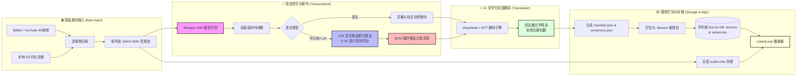

# 03 多模态影视精听数据流 (Multimodal Media Pipeline)

> [!NOTE]
> 本图展示从**“原始影视长音频 ➔ 智能转写分句 ➔ 幻觉清洗 ➔ 文学翻译 ➔ SQLite 毫秒级对齐 ➔ 手机端播放”**的全流程数据流转。

---

```mermaid
flowchart LR
    subgraph IN["🎬 原始素材输入 (Raw Input)"]
        A[Bilibili / YouTube 4K视频] --> B[音视频分离]
        C[本地 3小时长音频] --> B
        B --> D[单声道 16kHz WAV 音频流]
    end

    subgraph ASR["🤖 语音转写与断句 (Transcription)"]
        D --> E[Whisper ASR 模型识别]
        E --> F[词级毫秒时间戳]
        F --> G{语言类型}
        G -->|英文| H[空格与标点自然断句]
        G -->|中日韩 CJK| I[CJK 连写黄金断句算法<br>2~8s 语义区间切分]
        I --> J[BGM 循环假名幻觉清洗]
    end

    subgraph LLM["🧠 AI 文学化双语翻译 (Translation)"]
        H --> K[DeepSeek / GPT 翻译引擎]
        J --> K
        K --> L[信达雅文学精译<br>拒绝生硬机翻]
    end

    subgraph PKG["📦 课程打包与存储 (Storage & App)"]
        L --> M[生成 manifest.json & sentences.json]
        M --> N[打包为 .lllesson 离线包]
        N --> O[(手机端 SQLite DB: lessons & sentences)]
        D --> P[无损 audio.m4a 存储]
        O --> Q[ListenLoop 播放器]
        P --> Q
    end

    style E fill:#f9f,stroke:#333,stroke-width:2px
    style I fill:#bbf,stroke:#333,stroke-width:2px
    style J fill:#fbb,stroke:#333,stroke-width:2px
    style L fill:#dfd,stroke:#333,stroke-width:2px
    style Q fill:#ffd,stroke:#333,stroke-width:2px
```
